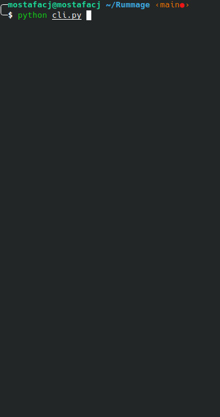

# Rummage

# About

rummage is a python tool to search for your breaches on the internet and dark web

and tell you if your information is breached 

# Screenshots

# Installation

```
git clone https://github.com/Juba0x4355/Leaks-Finder
```

# Recommended Python versions

The recommended version for Python 3 is **3.8. and above**

# Dependencies

Rummage depends on  `requests` ,`tor`,`datetime`,`os`,`threading`,`bs4`,`sqlte3`, `socks`,`socket`,`json` modules

These dependencies can be installed using the requirements file:

- Installation on Windows:
    
    `c:\python38\python.exe -m pip install -r requirements.txt`
    
- Installation on Linux
    
    `sudo pip install -r requirements.txt`
    

Alternatively, each module can be installed independently as shown below.

---

### Requests Module ([http://docs.python-requests.org/en/latest/](http://docs.python-requests.org/en/latest/))

- Install for Windows:

`c:\python27\python.exe -m pip install requests`

- Install for Ubuntu/Debian:

`sudo apt-get install python-requests`

- Install for Centos/Redhat:

`sudo yum install python-requests`

- Install using pip on Linux:

`sudo pip install requests`

## To Install tor

- [https://www.google.com/url?sa=t&rct=j&q=&esrc=s&source=web&cd=&ved=2ahUKEwi4ur_tqqr3AhVLi_0HHbvjBDQQFnoECBQQAw&url=https%3A%2F%2Ftb-manual.torproject.org%2Finstallation%2F&usg=AOvVaw3mYo5OI2enq-SRAwLNXrUw](https://www.google.com/url?sa=t&rct=j&q=&esrc=s&source=web&cd=&ved=2ahUKEwi4ur_tqqr3AhVLi_0HHbvjBDQQFnoECBQQAw&url=https%3A%2F%2Ftb-manual.torproject.org%2Finstallation%2F&usg=AOvVaw3mYo5OI2enq-SRAwLNXrUw)

### For Windows

1. Navigate to the Tor Browser [download page](https://www.torproject.org/download).
2. Download the Windows `.exe` file.
3. (Recommended) Verify the [file's signature](https://support.torproject.org/en/tbb/how-to-verify-signature/).
4. When the download is complete, double click the `.exe` file. Complete the installation wizard process.

## For macOS

1. Navigate to the Tor Browser [download page](https://www.torproject.org/download).
2. Download the macOS `.dmg` file.
3. (Recommended) Verify the [file's signature](https://support.torproject.org/en/tbb/how-to-verify-signature/).
4. When the download is complete, double click the `.dmg` file. Complete the installation wizard process.

## For GNU/Linux

1. Navigate to the Tor Browser [download page](https://www.torproject.org/download).
2. Download the GNU/Linux `.tar.xz` file.
3. (Recommended) Verify the [file's signature](https://support.torproject.org/en/tbb/how-to-verify-signature/).
4. Now follow either the graphical or the command-line method:

### Graphical method

- When the download is complete, extract the archive using an archive manager.
- You'll need to tell your GNU/Linux that you want the ability to execute shell scripts.
Navigate to the newly extracted Tor Browser directory.
Right click on `start-tor-browser.desktop`, open Properties or Preferences and change the permission to allow executing file as program. Double-click the icon to start up Tor Browser for the first time.


**Note:** On Ubuntu and some other distros if you try to launch `start-tor-browser.desktop` a text file might open up.
To change this behavior and launch Tor Browser instead, follow this:

- Launch "Files" (GNOME Files/Nautilus)
- Click on Preferences.
- Navigate to the 'Behavior' Tab.
- Select "Run them" or "Ask what to do" under "Executable Text Files".
- If you choose the latter click on "Run" after launching the `start-tor-browser.desktop` file.


---

### To Install datetime module

```
pip install datetime
```

---

### To install threading module

```
pip install thread6
```

---

### To install bs4 module

```
pip install bs4
```

---

### To install sqlite3 module

```
pip install pysqlite3
```

---

### To install sock module

```
pip install PySocks
```

---

### To install socket module

```
pip install sockets
```

---

### To install json module

```
pip install json
```

---

# Usage

you can use our service from 3 interfaces (CLI , GUI and Web UI)

## 1st UI (CLI)

- After you run the CLI file you will find a list of 2 choices (single search , full search )
- press “1”  or ”2” to choose
    - 1st choice is “single search” you write the item you want to search for breaches for and press enter then the result will appear if your data is breached or not
    - 2nd choice  is “full search” you write the items you want to search for breaches for and press enter then the result will appear if your data is breached or not
        - those items are (Email address , User name , visa card (1st 5 digits - 2nd 5 digits) ,Phone number)
    
    Example:
    




## 2nd UI (GUI)

Example:


## 3rd UI (web UI)

Example:

# License

Rummage is licensed under the GNU GPL v2.0 license. take a look at the [LICENSE](https://github.com/aboul3la/Sublist3r/blob/master/LICENSE)
 for more information.